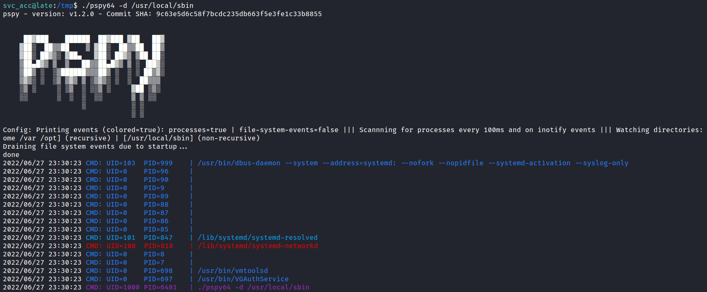

# Hmmm

## Pspy

[_pspy_](https://github.com/DominicBreuker/pspy) is a command line tool designed to snoop on processes without need for root permissions.

<figure><figcaption>
Running the pspy
</figcaption></figure>

## References

* [https://github.com/DominicBreuker/pspy](https://github.com/DominicBreuker/pspy)
