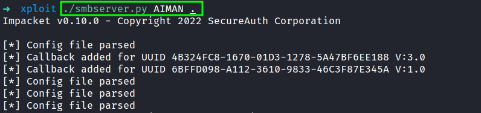
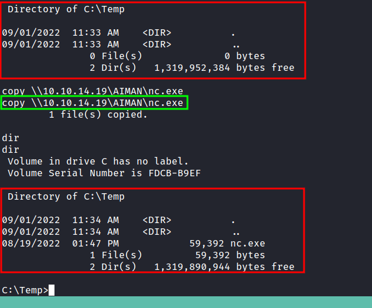

# Transferring files

## Impacket

Impacket is a collection of Python classes for working with network protocols.

### SMBserver.py

```bash
smbserver.py <SHARE> /path/to/tranfer
```

<figure><figcaption><p>Running the python smbserver</p></figcaption></figure>

```bash
copy \\$IP\<SHARE>\file.exe
```

<figure><figcaption><p>Transferring files with SMB</p></figcaption></figure>

## References

* [https://blog.ropnop.com/transferring-files-from-kali-to-windows/#smb](https://blog.ropnop.com/transferring-files-from-kali-to-windows/#smb)
