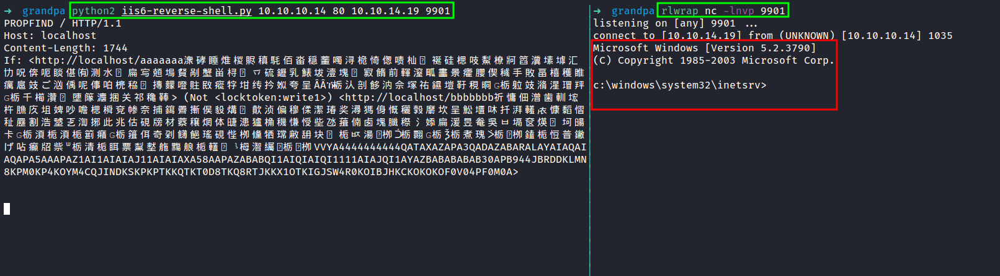

# IIS Server

## Exploitation

### Microsoft IIS 6.0

[CVE-2017-7269](https://github.com/g0rx/iis6-exploit-2017-CVE-2017-7269/blob/master/iis6%20reverse%20shell)

<figure><figcaption>
Running python payload to gain a shell
</figcaption></figure>
