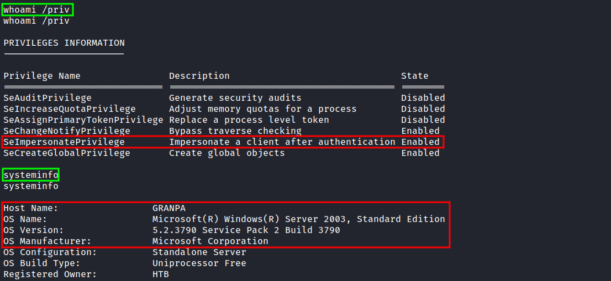
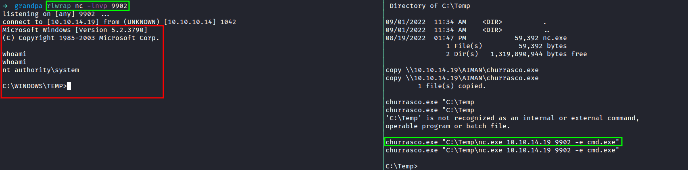

# Privileges

## SeImpersonatePrivilege: Privilege Escalation

### Microsoft Windows Server 2003

Checking the user privilege and the victim system infomation

<figure><figcaption>
Checking the victim system information
</figcaption></figure>

If, indeed the victim enable the _**SeImpersonatePrivilege.**_ This can lead the attacker into escalate the privilege with [Churrasco](https://github.com/Re4son/Churrasco).

<figure><figcaption>
Privilege escalation with Churrasco
</figcaption></figure>
